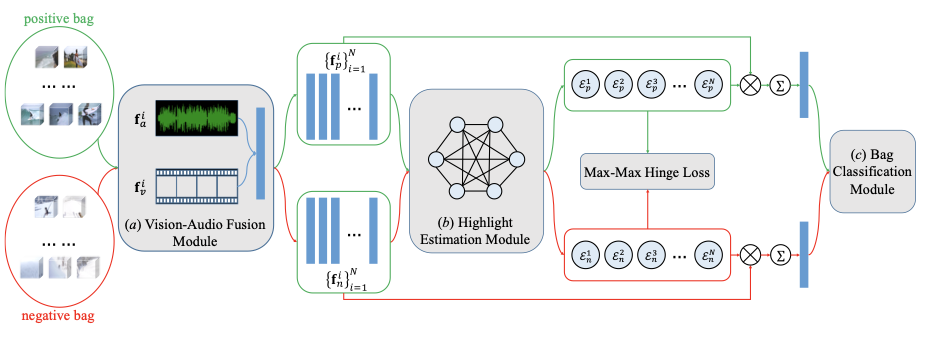

# [MINI-Net: Multiple Instance Ranking Network for Video Highlight Detection](https://arxiv.org/abs/2007.09833)

This repo contains source code for our ECCV 2020 work **MINI-Net: Multiple Instance Ranking Network for Video Highlight Detection**. Our model is implemented under Pytorch.



## Prerequisites

1. Pytorch 1.4 +
2. numpy
3. tqdm
4. moviepy
5. cv2

## Getting Started

Change directory to `src` and run following code:

```bash
CUDA_VISIBLE_DEVICES=1 python trainMIL.py --dataset youtube --domain gymnastics \
	--train_path /home/share/Highlight/proDataset/TrainingSet/ \
	--test_path /home/share/Highlight/proDataset/DomainSpecific \
	--topk_mAP 1 --FNet MILModel10 --AM AttentionModule \
	--DS MILDataset --AHLoss AdaptiveHingerLoss \
	--short_lower 10 --short_upper 40 --long_lower 60 --long_upper 60000 --bagsize 60 
```

Parameters:

- `CUDA_VISIBLE_DEVICES`: specify GPU Id for training
- `dataset`: choose dataset, alternatives: youtube, tvsum, cosum
- `domain`: choose target domain in given dataset, *e.g.*, gymnastics for youtube dataset
- `train_path`: extracted feature file for training, mentioned above
- `test_path`: extracted feature file for testing
- `topk_mAP`: specify test metric, 1 or 5 in our paper
- `FNet`: which model to use to predict highlight score for each segment in video, in our paper: `MILModel10`
- `AM`: which model to fuse visual feature and audio feature, in our paper: `AttentionModule_1 `
- `DS`: dataset model: in out paper: `MILDataset`
- `AHLoss`: hinger loss used in our paper

See `visual-audio fusion/opts.py` for details of data selection hyper-parameters.

## Main Results

- Youtube:

| Topic      | mAP    |
| ---------- | ------ |
| dog        | 0.5816 |
| gymnastics | 0.6165 |
| parkour    | 0.7020 |
| skating    | 0.7217 |
| skiing     | 0.5866 |
| surfing    | 0.6514 |

- TVsum:

| Topic | top-5 mAP |
| ----- | --------- |
| VT    | 0.8062    |
| VU    | 0.6832    |
| GA    | 0.7821    |
| MS    | 0.8183    |
| PK    | 0.7807    |
| PR    | 0.6584    |
| FM    | 0.5780    |
| BK    | 0.7502    |
| BT    | 0.8019    |
| DS    | 0.6551    |

- CoSum:

| Topic | top-5 mAP |
| ----- | --------- |
| BJ    | 0.8450    |
| BP    | 0.9887    |
| ET    | 0.9156    |
| ERC   | 1         |
| KP    | 0.9611    |
| MLB   | 0.9353    |
| NFL   | 1         |
| NDC   | 0.9536    |
| SL    | 0.8896    |
| SF    | 0.7897    |

## Reference

If you find our work helpful in your research, please cite our paper via:

```
Bib:
@inproceedings{hong2020mini,
title={MINI-Net: Multiple Instance Ranking Network for Video Highlight Detec- tion},
author={Hong, Fa-Ting and Huang, Xuanteng and Li, Wei-Hong and Zheng, Wei-Shi},
booktitle={European Conference on Computer Vision},
year={2020}
}
```

